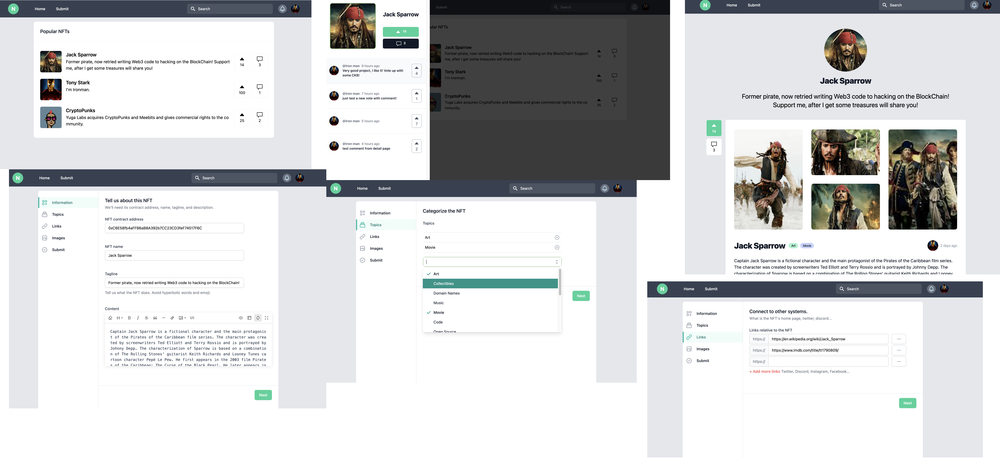

# NftTop.Best: Web3-ProductHunt

NftTop.Best, build on the IPFS and ERC1155.
We store all the detailed data in IPFS and submit the CID into our ERC1155 contract.
And make every one can mint && comment for every new token(as new project).

## Links

* [online demo](https://godwoken-testnet-v1.nfttop.best)
* [solidity contact on GodWoken Testnet v1](https://v1.betanet.gwscan.com/account/0xf6f3da45746f90d930b8affe792cdc22db7fa80ff42796e7265a32daf207fe29?search=0xe6903e124e5bdae8784674eb625f1c212efc789e)
* [demo video English](https://www.loom.com/share/0b2ffb70f3744de0a9dacd0a9c6ab65e)
* [demo video Chinese](https://www.loom.com/share/6dbfc4d3f18b487da0d6f0a5180419a1)

## Application Tech Stack

* [x] IPFS
* [x] Hardhat
* [x] Vercel
* [x] TailwindCSS
* [x] Vue3
* [x] Pinia (state store)
* [x] PWA
* [x] Vue-i18n
* [x] Villus (gql && pinia binding lib)
* [x] Vite2

## Features

* UserA can submit new project by create new token [code](https://github.com/NftTopBest/hackathon-city-filecoin-nervos/blob/main/web-app/src/pages/nfttop.best/submit.vue#L129)
  * Then the token owned by userA
  * Every new token has created time store by IPFS and get information by `nftStorageClient.status` api
  * New token metadata store on IPFS
  * ERC1155 contract has a map for every token to store the metadata CID: `tokenURIMap` [solidity code](https://github.com/NftTopBest/hackathon-city-filecoin-nervos/blob/main/solidity-contract/NFTList.sol#L45)
  * We create a `drag && drop IPFS image && gallery uploader` components that can be re-use for further developer, will pack it into a node_module later then to share with other vue3 developer
    * [thumbnail](https://github.com/NftTopBest/hackathon-city-filecoin-nervos/blob/main/web-app/src/components/FileUploader/thumbnail.vue) developer can use it to upload single image
    * [gallery](https://github.com/NftTopBest/hackathon-city-filecoin-nervos/blob/main/web-app/src/components/FileUploader/gallery.vue) developer can use it to upload mulitiple images at the same time, and can reorder the image
    * ipfs image can be show and has loading status via [ipfs-img](https://github.com/NftTopBest/hackathon-city-filecoin-nervos/blob/main/web-app/src/components/ipfs/img.vue) component
  * we also create a component that can get json file content from ipfs and display the data as comment list [code](https://github.com/NftTopBest/hackathon-city-filecoin-nervos/blob/main/web-app/src/components/ipfs/comments.vue)
* UserB can voteUp and with/without a comment message [code](https://github.com/NftTopBest/hackathon-city-filecoin-nervos/blob/main/web-app/src/components/ntb/slide/over/index.vue)
  * Store all metadata with voteUp with name, avatar, walletAddress by IPFS
  * Push the CID into the ERC1155 contract that we have a `commentCIDArrayMap` for them [solidity code](https://github.com/NftTopBest/hackathon-city-filecoin-nervos/blob/main/solidity-contract/NFTList.sol#L53)
  * Get the comment created time by `nftStorageClient.status` api [code](https://github.com/NftTopBest/hackathon-city-filecoin-nervos/blob/main/web-app/src/components/ipfs/comments.vue#L16)
* User can see the list of all token by [vue code: index page](https://github.com/NftTopBest/hackathon-city-filecoin-nervos/blob/main/web-app/src/pages/nfttop.best/index.vue#L34) via [solidity code: getTokenDataList api](https://github.com/NftTopBest/hackathon-city-filecoin-nervos/blob/main/solidity-contract/NFTList.sol#L60)
* User can click and slideover to see every token's voteUp && comment list [code](https://github.com/NftTopBest/hackathon-city-filecoin-nervos/blob/main/web-app/src/components/ntb/slide/over/index.vue)
* User can see the token detail page [code](https://github.com/NftTopBest/hackathon-city-filecoin-nervos/blob/main/web-app/src/pages/nfttop.best/%5BchainId%5D/%5BtokenId%5D.vue)
  * thumbnail
  * gallery images
  * voteUp && comment button and the slide-over
  * current token creator information also can click author avatar to chat with author via  chat.blockscan.com [code](https://github.com/NftTopBest/hackathon-city-filecoin-nervos/blob/main/web-app/src/pages/nfttop.best/%5BchainId%5D/%5BtokenId%5D.vue#L174)
* Features with IPFS && NFT.Storage
  * build an Drag & Drop component to upload image to ipfs via NFT.Stroage
    * upload as single image
    * upload as gallery, gallery images can re-order
  * wrap some api to easier used in application
  * image viewer component
    * while developer just input the cid `ipfs://xxxx`, component can auto parse into ipfs link url
    * show loading animation before image load finished
  * use NFT.Strage status api to get file created time
  * has a cache logic in client-side that while user revisit the same cid can just get from local data with almost zero second ;)

## 功能

* UserA 可以通过创建新代币 [code](https://github.com/NftTopBest/hackathon-city-filecoin-nervos/blob/main/web-app/src/pages/nfttop.best/submit.Vue#L129)
  * 那么userA拥有的token
  * 每个新令牌都通过 IPFS 创建时间存储并通过 `nftStorageClient.status` api 获取信息
  * IPFS 上的新令牌元数据存储
  * ERC1155 合约对每个代币都有一个映射来存储元数据 CID：`tokenURIMap` [solidity 代码](https://github.com/NftTopBest/hackathon-city-filecoin-nervos/blob/main/solidity-contract/NFTList.sol#L45)
  * 我们创建了一个 `drag && drop IPFS image && gallery uploader` 组件，可以为更多的开发者重复使用，稍后将其打包到 node_module 中，然后与其他 vue3 开发者共享
    * [缩略图](https://github.com/NftTopBest/hackathon-city-filecoin-nervos/blob/main/web-app/src/components/FileUploader/thumbnail.vue) 开发者可以使用它上传单张图片
    * [图库](https://github.com/NftTopBest/hackathon-city-filecoin-nervos/blob/main/web-app/src/components/FileUploader/gallery.vue) 开发者可以使用它上传多张图片到同时，并且可以重新排序图像
    * ipfs 图像可以通过 [ipfs-img](https://github.com/NftTopBest/hackathon-city-filecoin-nervos/blob/main/web-app/src/components/ipfs/img.vue) 组件
  * 我们还创建了一个组件，可以从 ipfs 获取 json 文件内容并将数据显示为评论列表 [代码](https://github.com/NftTopBest/hackathon-city-filecoin-nervos/blob/main/web-app/src/components/ipfs/comments.vue)
* UserB 可以投票和有/没有评论消息 [代码](<<https://github.com/NftTopBest/hackathon-city-filecoin-nervos/blob/main/web-app/src/components/ntb/slide/over/index.vue>)
  * 通过 IPFS 存储所有带有名称、头像、walletAddress 的 voteUp 元数据
  * 将 CID 推送到 ERC1155 合约中，我们为其提供了一个 `commentCIDArrayMap` [solidity 代码](https://github.com/NftTopBest/hackathon-city-filecoin-nervos/blob/main/solidity-contract/NFTList.溶胶#L53)
  * 通过`nftStorageClient.status` api [code](https://github.com/NftTopBest/hackathon-city-filecoin-nervos/blob/main/web-app/src/components/ipfs/comments获取评论创建时间.vue#L16)
* 用户可以通过[vue code: index page](https://github.com/NftTopBest/hackathon-city-filecoin-nervos/blob/main/web-app/src/pages/nfttop.best/index.vue#L34) 通过 [solidity 代码：getTokenDataList api](https://github.com/NftTopBest/hackathon-city-filecoin-nervos/blob/main/solidity-contract/NFTList.sol#L60)
* 用户可以点击滑动查看每个代币的投票&&评论列表[代码](https://github.com/NftTopBest/hackathon-city-filecoin-nervos/blob/main/web-app/src/components/ntb/滑动/over/index.vue)
* 用户可以查看代币详情页面[code](https://github.com/NftTopBest/hackathon-city-filecoin-nervos/blob/main/web-app/src/pages/nfttop.best/%5BchainId%5D/%5BtokenId%5D.vue)
  * 缩略图
  * 画廊图片
  * voteUp && 评论按钮和幻灯片
  * 当前代币创建者信息也可以点击作者头像通过chat.blockscan.com与作者聊天[code](https://github.com/NftTopBest/hackathon-city-filecoin-nervos/blob/main/web-app/src/pages/nfttop.best/%5BchainId%5D/%5BtokenId%5D.vue#L174)
* 针对 IPFS && NFT.Storage 的优化
  * 构建一个拖放组件以通过 NFT.Stroage 将图像上传到 ipfs
    * 上传为单张图片
    * 上传为图库，图库图片可以重新排序
  * 包装一些 api 以便在应用程序中更容易使用
  * 图片查看器组件
    * 开发者只需输入 cid `ipfs://xxxx`，组件可以自动解析为 ipfs 链接 url
    * 在图像加载完成之前显示加载动画
  * 使用 NFT.Stage status api 获取文件创建时间
  * 在客户端有一个缓存逻辑，当用户重新访问同一个 cid 时，可以几乎零秒从本地数据中获取；）

## Further Plan

* make a vue3 component for the ipfs image uploader and viewer component
* make the NTB project online and Go-To-Market design && features
* add NFT marketplace function that provide users the trading NFT tokens in the platform

## 团队成员

| 姓名 Name | 角色 Role     | 个人经历 Bio | 联系方式 Contact     |
| ---- | ------------------- | --- | ----------------------- |
|  Bruce | Full-Stack developer | 15+ 年全栈开发经验，创过业，外资上市公司带 20 人前端团队 | github: @NftTopBest |
